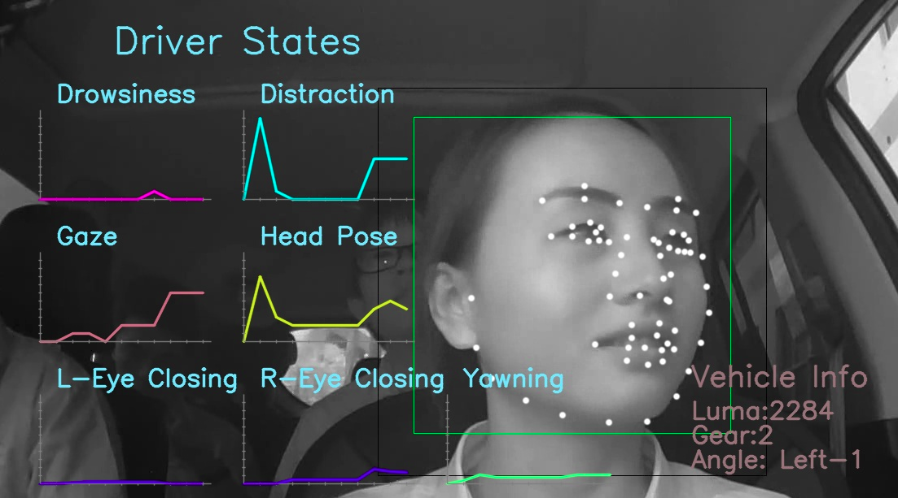

# FDUDrivers (FDU Drivers Image Dataset)

We have collected 20000 driving images of 100 different drivers. These images are taken under real driving environment, and the ratio of dynamic to static driving environment is around 3:7. The weather and scenes when these pictures were collected are shown in the following table.

|              | **class**   | **ratio** |
| ----         | ----        | ---- |
| **Weather**  | Sunny day   | 20%  |
|              | Cloudy day  | 15%  |
|              | Rainy day   | 10%  |
|              | Snowy day   | 5%   |
|              | Sunny night | 20%  |
|              | Cloudy night | 15% |
|              | Rainy night | 10%  |
|              | Snowy night | 5%   |
| **Location** | City        | 20%  |
|              | Highway     | 50%  |
|              | Suburban    | 30%  |
| **Vehicle**  | Sedan       | 50%  |
|              | SUV         | 30%  |
|              | Truck       | 20%  |
| **Age**      | 20 - 40     | 60%  |
|              | 40 - 60     | 30%  |
|              | 60 - 70     | 10%  |

# Terms & Conditions
The dataset is available for non-commercial research purposes only.

You agree not to reproduce, duplicate, copy, sell, trade, resell or exploit for any commercial purposes, any portion of the images and any portion of derived data.

# How to get the Dataset
This database is publicly available. It is free for professors and researcher scientists affiliated to a University. Permission to use but not reproduce or distribute our database is granted to all researchers given that the following steps are properly followed: Send an e-mail to Austin (18110860061@fudan.edu.cn) or Xinlei Li (18110860019@fudan.edu.cn) before downloading the database. Your Email MUST be set from a valid University account and MUST include the following text:

1. Subject: Application to download the FDU/SHUTCM Dataset          
2. Name: <your first and last name>
3. Affiliation: <University where you work>
4. Department: <your department>
5. Position: <your job title>
6. Email: <must be the email at the above mentioned institution>
	
I have read and agree to the terms and conditions. 

This database will only be used for research purposes. 

I will not make any part of this database available to a third party. 

I'll not sell any part of this database or make any profit from its use.
	
# Contact Authors
Austin ,e-mail: 18110860061@fudan.edu.cn

Xinlei Li, e-mail: 18110860019@fudan.edu.cn